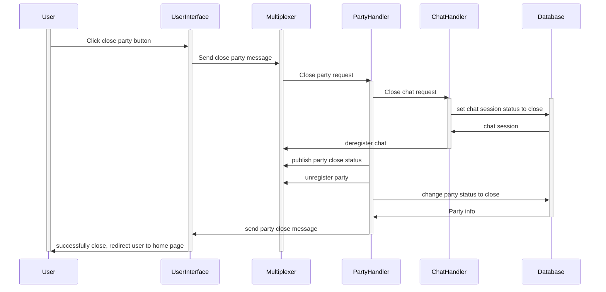

```mermaid
sequenceDiagram
participant User
participant UserInterface
participant Multiplexer
participant PartyHandler
participant ChatHandler
participant Database

activate User
activate Multiplexer
activate UserInterface
User->>UserInterface: Click close party button
UserInterface->>Multiplexer: Send close party message
Multiplexer->>PartyHandler: Close party request
activate PartyHandler
PartyHandler->>ChatHandler: Close chat request
activate ChatHandler
activate Database
ChatHandler->>Database: set chat session status to close
Database->>ChatHandler: chat session
ChatHandler->>Multiplexer: deregister chat
deactivate ChatHandler
PartyHandler->>Multiplexer: publish party close status
PartyHandler->>Multiplexer: unregister party
PartyHandler->>Database: change party status to close
Database->>PartyHandler: Party info
deactivate Database
PartyHandler->>UserInterface: send party close message
deactivate PartyHandler
UserInterface->>User: successfully close, redirect user to home page


deactivate Multiplexer
deactivate User
deactivate UserInterface

```
