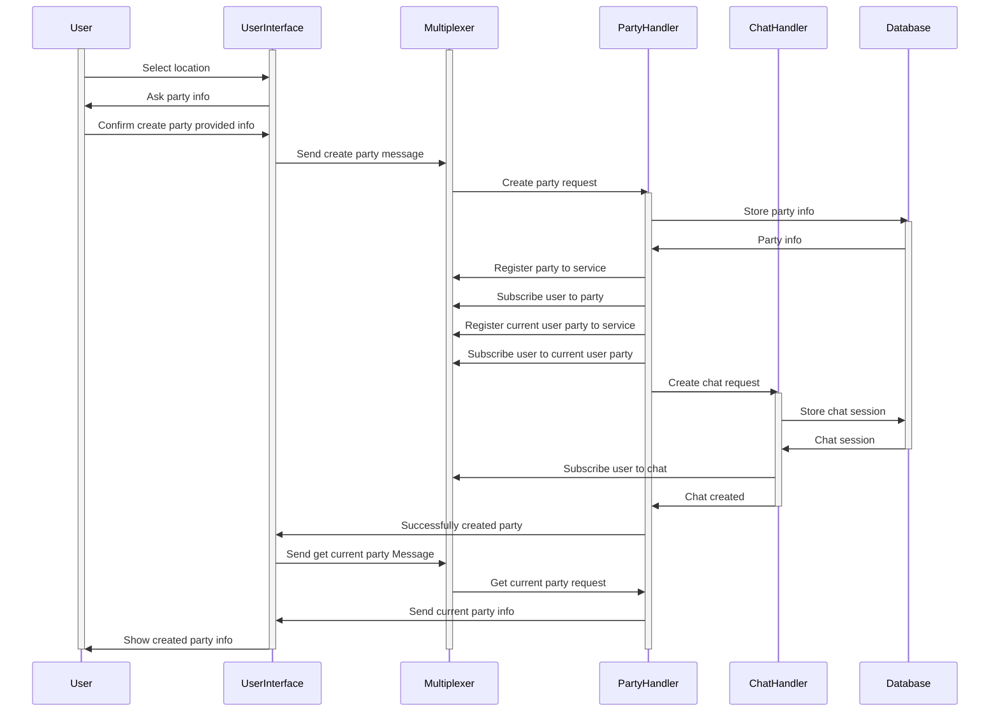

```mermaid
sequenceDiagram
participant User
participant UserInterface
participant Multiplexer
participant PartyHandler
participant ChatHandler
participant Database

activate User
activate Multiplexer
activate UserInterface
User->>UserInterface: Select location
UserInterface->>User: Ask party info

User->>UserInterface: Confirm create party provided info
UserInterface->>Multiplexer: Send create party message
Multiplexer->>PartyHandler: Create party request
activate PartyHandler
PartyHandler->>Database: Store party info
activate Database
Database->>PartyHandler: Party info
PartyHandler->>Multiplexer: Register party to service
PartyHandler->>Multiplexer: Subscribe user to party
PartyHandler->>Multiplexer: Register current user party to service
PartyHandler->>Multiplexer: Subscribe user to current user party
PartyHandler->>ChatHandler: Create chat request
activate ChatHandler
ChatHandler->>Database: Store chat session
Database->>ChatHandler: Chat session
deactivate Database
ChatHandler->>Multiplexer: Subscribe user to chat
ChatHandler->>PartyHandler: Chat created
deactivate ChatHandler

PartyHandler->>UserInterface: Successfully created party
UserInterface->>Multiplexer: Send get current party Message
Multiplexer->>PartyHandler: Get current party request
PartyHandler->>UserInterface: Send current party info
UserInterface->>User: Show created party info


deactivate Multiplexer
deactivate PartyHandler
deactivate User
deactivate UserInterface

```
