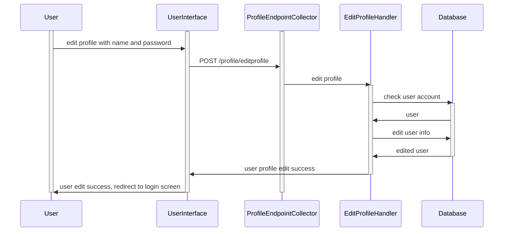

```mermaid
sequenceDiagram
participant User
participant UserInterface
participant ProfileEndpointCollector
participant EditProfileHandler
participant Database

activate User
activate UserInterface
activate ProfileEndpointCollector
User->>UserInterface: edit profile with name and password
UserInterface->>ProfileEndpointCollector: POST /profile/editprofile
ProfileEndpointCollector->>EditProfileHandler: edit profile
activate EditProfileHandler
EditProfileHandler->>Database: check user account
activate Database
Database->> EditProfileHandler: user
EditProfileHandler->>Database: edit user info
Database->>EditProfileHandler: edited user
deactivate Database
EditProfileHandler->>UserInterface: user profile edit success
deactivate EditProfileHandler
UserInterface->>User: user edit success, redirect to login screen


deactivate User
deactivate UserInterface
deactivate ProfileEndpointCollector


```
