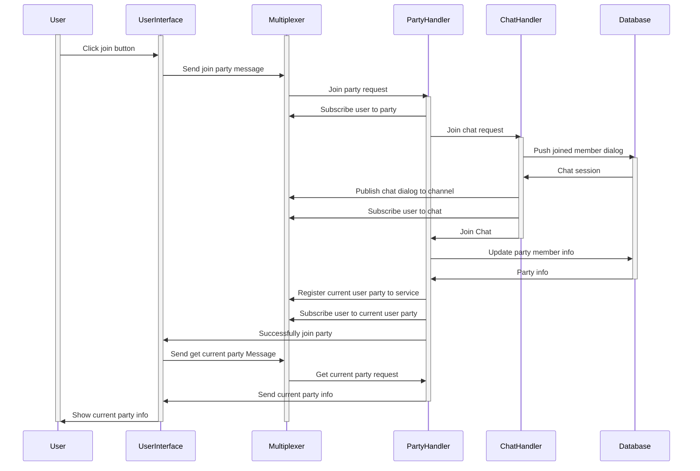

```mermaid
sequenceDiagram
participant User
participant UserInterface
participant Multiplexer
participant PartyHandler
participant ChatHandler
participant Database

activate User
activate Multiplexer
activate UserInterface
User->>UserInterface: Click join button
UserInterface->>Multiplexer: Send join party message
Multiplexer->>PartyHandler: Join party request
activate PartyHandler
PartyHandler->>Multiplexer: Subscribe user to party
PartyHandler->>ChatHandler: Join chat request
activate ChatHandler
ChatHandler->>Database: Push joined member dialog
activate Database
Database->>ChatHandler: Chat session
ChatHandler->>Multiplexer: Publish chat dialog to channel
ChatHandler->>Multiplexer: Subscribe user to chat
ChatHandler->>PartyHandler: Join Chat
deactivate ChatHandler
PartyHandler->>Database: Update party member info
Database->>PartyHandler: Party info
deactivate Database
PartyHandler->>Multiplexer: Register current user party to service
PartyHandler->>Multiplexer: Subscribe user to current user party

PartyHandler->>UserInterface: Successfully join party
UserInterface->>Multiplexer: Send get current party Message
Multiplexer->>PartyHandler: Get current party request
PartyHandler->>UserInterface: Send current party info
deactivate PartyHandler
UserInterface->>User: Show current party info


deactivate Multiplexer
deactivate User
deactivate UserInterface

```
