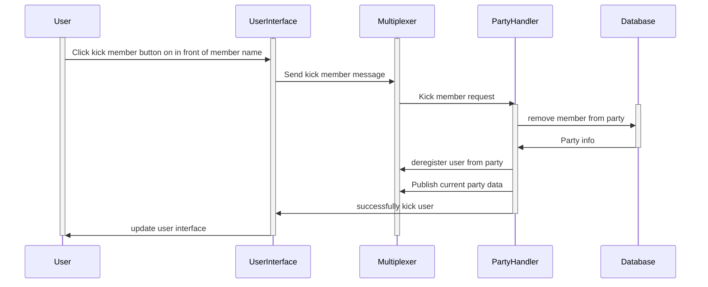

```mermaid
sequenceDiagram
participant User
participant UserInterface
participant Multiplexer
participant PartyHandler
participant Database

activate User
activate Multiplexer
activate UserInterface

User->>UserInterface: Click kick member button on in front of member name
UserInterface->>Multiplexer: Send kick member message
Multiplexer->>PartyHandler: Kick member request
activate PartyHandler
activate Database
PartyHandler->>Database: remove member from party
Database->>PartyHandler: Party info
deactivate Database
PartyHandler->>Multiplexer: deregister user from party
PartyHandler->>Multiplexer: Publish current party data
PartyHandler->>UserInterface: successfully kick user
deactivate PartyHandler
UserInterface->>User: update user interface


deactivate Multiplexer
deactivate User
deactivate UserInterface

```
