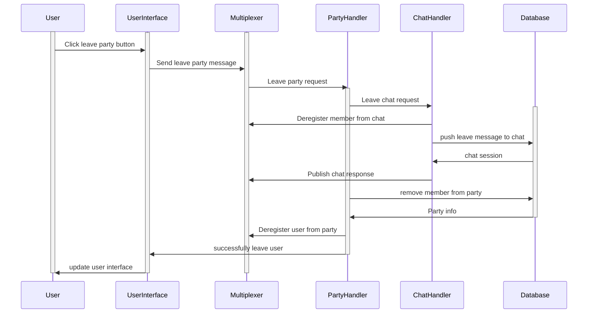

```mermaid
sequenceDiagram
participant User
participant UserInterface
participant Multiplexer
participant PartyHandler
participant ChatHandler
participant Database


activate User
activate Multiplexer
activate UserInterface

User->>UserInterface: Click leave party button
UserInterface->>Multiplexer: Send leave party message
Multiplexer->>PartyHandler: Leave party request
activate PartyHandler
PartyHandler->>ChatHandler: Leave chat request
activate Database
ChatHandler->>Multiplexer: Deregister member from chat
ChatHandler->>Database: push leave message to chat
Database->>ChatHandler: chat session
ChatHandler->>Multiplexer: Publish chat response
PartyHandler->>Database: remove member from party
Database->>PartyHandler: Party info
deactivate Database
PartyHandler->>Multiplexer: Deregister user from party
PartyHandler->>UserInterface: successfully leave user
deactivate PartyHandler
UserInterface->>User: update user interface


deactivate Multiplexer
deactivate User
deactivate UserInterface

```
