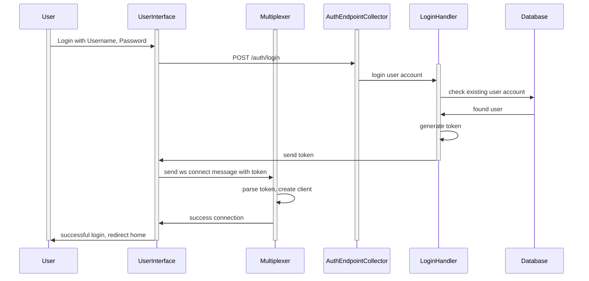

```mermaid
sequenceDiagram
participant User
participant UserInterface
participant Multiplexer
participant AuthEndpointCollector
participant LoginHandler
participant Database


activate User
activate UserInterface
activate AuthEndpointCollector
activate Multiplexer
User->>UserInterface: Login with Username, Password
UserInterface->>AuthEndpointCollector: POST /auth/login
activate LoginHandler
AuthEndpointCollector->>LoginHandler: login user account
LoginHandler->>Database: check existing user account
Database->> LoginHandler: found user
LoginHandler->>LoginHandler: generate token
LoginHandler->>UserInterface: send token
deactivate LoginHandler
UserInterface->>Multiplexer: send ws connect message with token
Multiplexer->>Multiplexer: parse token, create client
Multiplexer->>UserInterface: success connection


UserInterface->>User: successful login, redirect home


deactivate Multiplexer
deactivate User
deactivate UserInterface
deactivate AuthEndpointCollector


```
