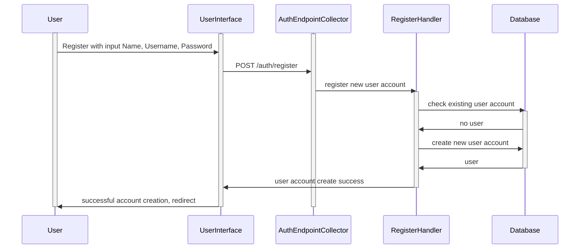

```mermaid
sequenceDiagram
participant User
participant UserInterface
participant AuthEndpointCollector
participant RegisterHandler
participant Database

activate User
activate UserInterface
activate AuthEndpointCollector
User->>UserInterface: Register with input Name, Username, Password
UserInterface->>AuthEndpointCollector: POST /auth/register
AuthEndpointCollector->>RegisterHandler: register new user account
activate RegisterHandler
RegisterHandler->>Database: check existing user account
activate Database
Database->> RegisterHandler: no user
RegisterHandler->>Database: create new user account
Database->>RegisterHandler: user
deactivate Database
RegisterHandler->>UserInterface: user account create success
deactivate RegisterHandler
UserInterface->>User: successful account creation, redirect


deactivate User
deactivate UserInterface
deactivate AuthEndpointCollector


```
