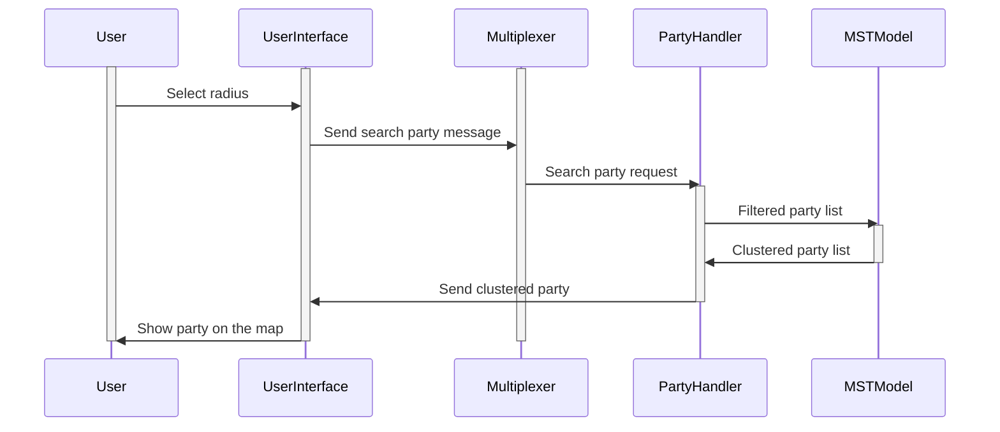

```mermaid
sequenceDiagram
participant User
participant UserInterface
participant Multiplexer
participant PartyHandler
participant MSTModel

activate User
activate Multiplexer
activate UserInterface
User->>UserInterface: Select radius
UserInterface->>Multiplexer: Send search party message
Multiplexer->>PartyHandler: Search party request
activate PartyHandler

PartyHandler->>MSTModel: Filtered party list
activate MSTModel
MSTModel->>PartyHandler: Clustered party list
deactivate MSTModel


PartyHandler->>UserInterface: Send clustered party
deactivate PartyHandler
UserInterface->>User: Show party on the map


deactivate Multiplexer
deactivate User
deactivate UserInterface

```
