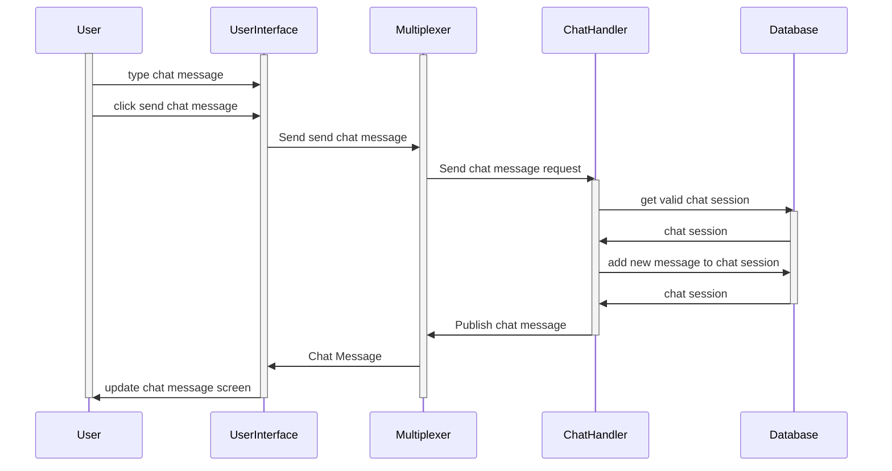

```mermaid
sequenceDiagram
participant User
participant UserInterface
participant Multiplexer
participant ChatHandler
participant Database

activate User
activate Multiplexer
activate UserInterface
User->>UserInterface: type chat message
User->>UserInterface: click send chat message
UserInterface->>Multiplexer: Send send chat message
Multiplexer->>ChatHandler: Send chat message request
activate ChatHandler
ChatHandler->>Database: get valid chat session
activate Database
Database->>ChatHandler: chat session
ChatHandler->>Database: add new message to chat session
Database->>ChatHandler: chat session
deactivate Database
ChatHandler->>Multiplexer: Publish chat message
deactivate ChatHandler
Multiplexer->>UserInterface: Chat Message
UserInterface->>User: update chat message screen


deactivate Multiplexer
deactivate User
deactivate UserInterface

```
