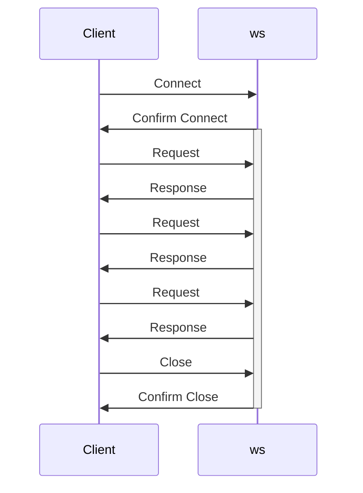
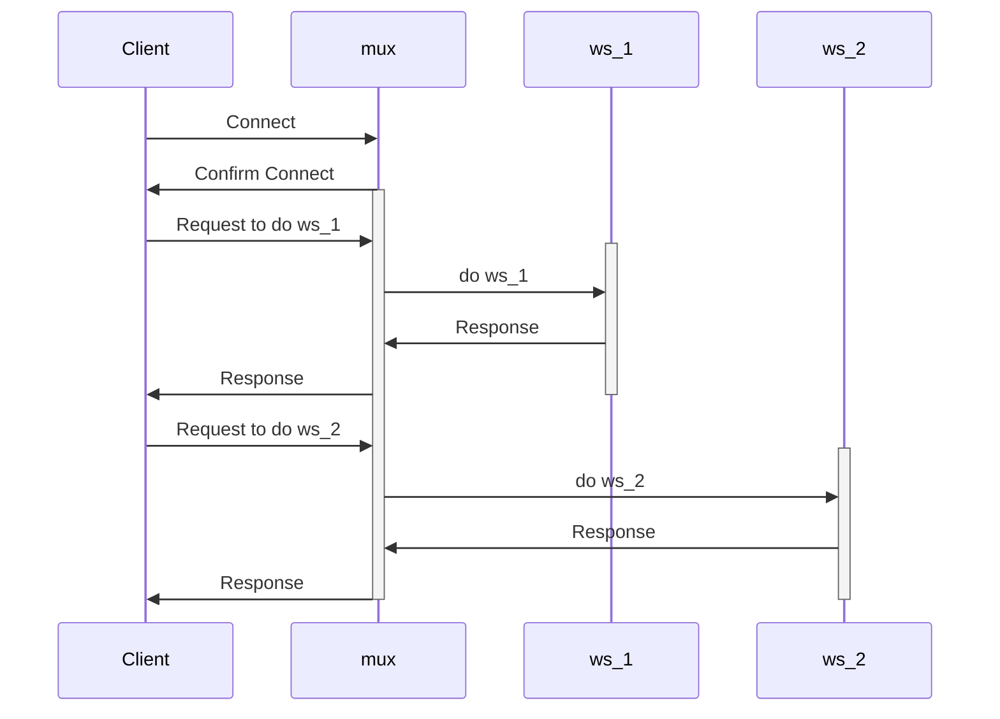

```mermaid
sequenceDiagram
participant Client
participant ws

Client->>ws: Connect
ws->>Client: Confirm Connect

activate ws

Client->>ws: Request
ws->>Client: Response

Client->>ws: Request
ws->>Client: Response

Client->>ws: Request
ws->>Client: Response

Client->>ws: Close
ws->>Client: Confirm Close

deactivate ws
```


```mermaid
sequenceDiagram
participant Client
participant mux
participant ws_1
participant ws_2

Client->>mux: Connect
mux->>Client: Confirm Connect

activate mux

Client->>mux: Request to do ws_1
activate ws_1
mux->>ws_1: do ws_1
ws_1->>mux: Response
mux->>Client: Response

deactivate ws_1


Client->>mux: Request to do ws_2
activate ws_2
mux->>ws_2: do ws_2
ws_2->>mux: Response
mux->>Client: Response

deactivate ws_2

deactivate mux


```

```json
{
  "type": "ws_1",
  "params": ....
  }
```
