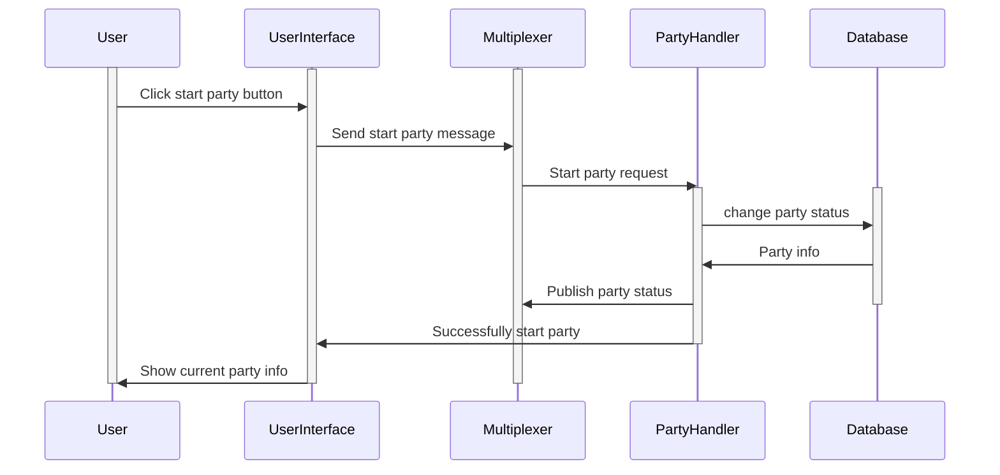

```mermaid
sequenceDiagram
participant User
participant UserInterface
participant Multiplexer
participant PartyHandler
participant Database

activate User
activate Multiplexer
activate UserInterface
User->>UserInterface: Click start party button
UserInterface->>Multiplexer: Send start party message
Multiplexer->>PartyHandler: Start party request
activate PartyHandler
activate Database
PartyHandler->>Database: change party status
Database->>PartyHandler: Party info
PartyHandler->>Multiplexer: Publish party status

deactivate Database

PartyHandler->>UserInterface: Successfully start party
deactivate PartyHandler
UserInterface->>User: Show current party info


deactivate Multiplexer
deactivate User
deactivate UserInterface

```
